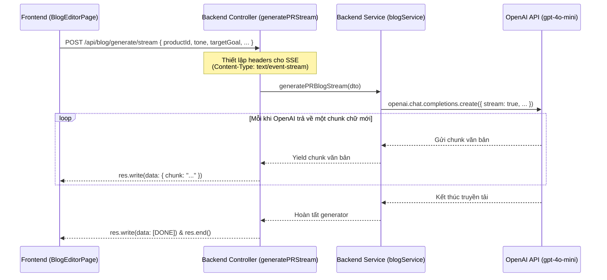

# TÀI LIỆU TÍCH HỢP AI & HƯỚNG DẪN VẬN HÀNH: AI MARKETING & PRODUCT BLOG

Tài liệu này cung cấp cái nhìn chi tiết về cách phân hệ **AI Marketing & Product Blog** hoạt động trong dự án **ERP-MINI**, tập trung vào việc tích hợp dịch vụ OpenAI API (`gpt-4o-mini`), cấu trúc mã nguồn ở Backend & Frontend, cùng hướng dẫn cách vận hành chi tiết.

---

## 1. Giới thiệu tổng quan
Phân hệ AI Marketing & Product Blog hỗ trợ các phòng ban Sales và Marketing của doanh nghiệp tự động hóa việc sáng tạo các bài viết tiếp thị, tin tức chuẩn SEO hoặc bài viết giới thiệu dựa trên dữ liệu sản phẩm có sẵn trong ERP-MINI bằng trí tuệ nhân tạo (AI).

Tính năng nổi bật:
*   **Sinh bài viết PR trọn gói (JSON Mode):** Tự động tạo bài viết cùng tiêu đề, tóm tắt, từ khóa SEO và gợi ý SEO metadata.
*   **Sinh bài viết trực tiếp (SSE Streaming):** Tạo hiệu ứng gõ chữ thời gian thực (typing effect) ngay trên khung soạn thảo Markdown.
*   **Hiển thị chuẩn SEO & CTA (Call to Action):** Bài viết công khai được hiển thị dạng blog tin tức chuyên nghiệp, không kèm Sidebar quản trị, có đính kèm widget gợi ý mua sản phẩm ở cuối bài viết.

---

## 2. Các điểm tích hợp OpenAI trong mã nguồn (OpenAI Integration Points)

### 2.1. Cấu hình môi trường (Environment Config)
*   **Tệp cấu hình:** `erp-backend/.env`
*   **Biến môi trường liên quan:**
    *   `OPENAI_API_KEY` hoặc `LLM_API_KEY`: API Key được cấp từ OpenAI để gọi các mô hình GPT.
    *   `RAG_PROVIDER` (Tùy chọn): Mặc định là `"openai"`. Có thể chuyển sang `"ollama"` nếu muốn chạy mô hình cục bộ (Local LLM), nhưng hiện tại JSON Mode và Stream Mode chỉ hỗ trợ ổn định nhất trên OpenAI.
    *   `LLM_MODEL` (Tùy chọn): Mô hình hoạt động, mặc định là `"gpt-4o-mini"` để tối ưu hóa chi phí và tốc độ phản hồi.

### 2.2. Khởi tạo Client OpenAI
*   **Vị trí file:** [blog.service.ts](file:///d:/Nam3/KLTN/ERP-MINI/erp-backend/src/modules/blog/services/blog.service.ts)
*   **Chi tiết code khởi tạo (Dòng 8 - 10):**
    ```typescript
    import OpenAI from "openai";

    const openai = new OpenAI({
      apiKey: process.env.OPENAI_API_KEY || process.env.LLM_API_KEY,
    });
    ```

### 2.3. Hai phương thức sinh nội dung bằng AI
Trong [blog.service.ts](file:///d:/Nam3/KLTN/ERP-MINI/erp-backend/src/modules/blog/services/blog.service.ts), chúng ta cài đặt hai cách thức gọi OpenAI tùy theo nhu cầu trải nghiệm người dùng:

#### A. Sinh bài viết trọn gói dạng cấu trúc JSON
*   **Mục đích:** Trả về một JSON Object chứa đầy đủ thông tin bài viết và dữ liệu SEO phục vụ cho chức năng tự động điền form (Auto-fill).
*   **Hàm xử lý:** `generatePRBlog(dto: GeneratePRBlogDto)`
*   **Cơ chế hoạt động:** Sử dụng tính năng **Structured Outputs** của OpenAI qua tham số `response_format: { type: "json_object" }`. Hệ thống sẽ ép mô hình trả về định dạng JSON chuẩn theo yêu cầu trong `systemPrompt`.
*   **Đoạn mã cốt lõi:**
    ```typescript
    const response = await openai.chat.completions.create({
      model: activeModel,
      messages: [
        { role: "system", content: systemPrompt },
        { role: "user", content: `Hãy viết bài PR cho sản phẩm ${product.name} ngay bây giờ theo định dạng JSON yêu cầu.` }
      ],
      response_format: { type: "json_object" },
      temperature: 0.7,
    });

    const resultText = response.choices[0]?.message?.content || "{}";
    return JSON.parse(resultText);
    ```

#### B. Sinh bài viết dạng Live Stream (SSE Streaming)
*   **Mục đích:** Tạo trải nghiệm chữ chạy ra mượt mà từng dòng trên màn hình, giúp người dùng không phải chờ đợi lâu khi viết các bài viết dài.
*   **Hàm xử lý:** `generatePRBlogStream(dto: GeneratePRBlogDto)` (Sử dụng Async Generator).
*   **Cơ chế hoạt động:** Gửi request với `stream: true` tới OpenAI. Nhận về từng `chunk` dữ liệu thông qua vòng lặp `for await (const chunk of responseStream)` và `yield` về cho Controller đóng gói gửi đi dưới chuẩn SSE.
*   **Đoạn mã cốt lõi:**
    ```typescript
    const responseStream = await openai.chat.completions.create({
      model: activeModel,
      messages: [
        { role: "system", content: systemPrompt },
        { role: "user", content: `Hãy viết bài PR cho sản phẩm ${product.name} ngay.` }
      ],
      stream: true,
      temperature: 0.7,
    });

    for await (const chunk of responseStream) {
      const content = chunk.choices[0]?.delta?.content || "";
      if (content) {
        yield content;
      }
    }
    ```

---

## 3. Kiến trúc luồng dữ liệu sinh nội dung (Data Flow)

Biểu đồ trình tự thể hiện luồng dữ liệu khi người dùng yêu cầu sinh bài viết dạng Live Stream từ giao diện:



---

## 4. Danh sách các API Endpoints của Module Blog

Các route được định nghĩa tại [blog.route.ts](file:///d:/Nam3/KLTN/ERP-MINI/erp-backend/src/modules/blog/routes/blog.route.ts):

| Phương thức | Endpoint | Middleware / Quyền hạn | Mô tả |
| :--- | :--- | :--- | :--- |
| **GET** | `/api/blog` | Không yêu cầu (Công khai) | Lấy danh sách bài viết (hỗ trợ filter status, search, productId) |
| **GET** | `/api/blog/:idOrSlug` | Không yêu cầu (Công khai) | Xem chi tiết bài viết theo ID hoặc Slug |
| **POST** | `/api/blog` | `ADMIN`, `CEO`, `SALESMANAGER`, `SALES` | Tạo bài viết mới thủ công |
| **PUT** | `/api/blog/:id` | `ADMIN`, `CEO`, `SALESMANAGER`, `SALES` | Cập nhật bài viết |
| **DELETE** | `/api/blog/:id` | `ADMIN`, `CEO`, `SALESMANAGER` | Xóa bài viết |
| **POST** | `/api/blog/generate` | `ADMIN`, `CEO`, `SALESMANAGER`, `SALES` | Yêu cầu AI sinh bài viết dạng cấu trúc JSON |
| **POST** | `/api/blog/generate/stream` | `ADMIN`, `CEO`, `SALESMANAGER`, `SALES` | Yêu cầu AI sinh bài viết dạng Live Stream (SSE) |

---

## 5. Cách xử lý Stream ở Frontend

Để hiển thị văn bản chạy ra mượt mà và không bị nghẽn do thư viện HTTP mặc định (Axios thường chờ tải xong toàn bộ dữ liệu mới phản hồi), Frontend sử dụng trực tiếp **Fetch API** kết hợp **TextDecoder** để đọc luồng byte từ Backend:

*   **Vị trí file:** [blog.api.ts](file:///d:/Nam3/KLTN/ERP-MINI/erp-frontend/src/features/blog/api/blog.api.ts) - hàm `generatePRBlogStream`.
*   **Cách thức bóc tách dòng SSE:**
    1. Đọc stream bằng `response.body.getReader()`.
    2. Đọc tuần tự dữ liệu cho đến khi `done === true`.
    3. Decode mảng byte thành chuỗi ký tự UTF-8.
    4. Tách chuỗi theo ký tự xuống dòng `\n` để phân biệt các dòng sự kiện bắt đầu bằng `data: `.
    5. Parse đối tượng JSON ở mỗi dòng, trích xuất thuộc tính `chunk` và gửi về component qua callback `onChunk`.

---

## 6. Hướng dẫn vận hành chi tiết (Operation Guide)

### Bước 1: Thiết lập khóa API
Hãy đảm bảo rằng bạn đã thêm khóa API hợp lệ trong tệp `.env` của backend:
```env
OPENAI_API_KEY=sk-proj-xxxxxx...
```

### Bước 2: Tạo bài viết mới với AI Assistant
1. Truy cập vào giao diện quản trị ERP-MINI tại địa chỉ `http://localhost:3000/`.
2. Đăng nhập bằng tài khoản có quyền truy cập phù hợp (ví dụ: `CEO`, `ADMIN`, `SALESMANAGER`, hoặc `SALES`).
3. Trên thanh menu Sidebar bên trái, nhấp vào mục **"AI Blog"**.
4. Bấm chọn nút **"Thêm bài viết mới"** ở góc trên bên phải để chuyển tới trang soạn thảo.
5. Tại cột bên phải (**AI Assistant Panel**):
    *   **Chọn sản phẩm:** Chọn một sản phẩm trong hệ thống ERP mà bạn muốn viết bài quảng bá.
    *   **Chọn giọng điệu (Tone):** Chọn phong cách viết (Chuyên nghiệp, Thuyết phục, Hài hước, Khơi gợi tò mò).
    *   **Mục tiêu bài viết (Goal):** Chọn hướng phát triển nội dung (Nêu bật tính năng, Khuyến mãi giảm giá, So sánh sản phẩm).
    *   **Ghi chú bổ sung:** Nhập thêm từ khóa hoặc yêu cầu đặc biệt dành cho AI (ví dụ: *"Nhấn mạnh công nghệ tự động hóa, viết dưới 500 từ"*).
6. Tiến hành sinh nội dung:
    *   Nếu chọn **"Tạo trọn gói (JSON)"**: Chờ khoảng 3-5 giây, AI sẽ tự điền tất cả các trường: Tiêu đề, Slug, Tóm tắt, Nội dung Markdown, Từ khóa SEO, SEO Title và SEO Meta.
    *   Nếu chọn **"Viết trực tiếp (Stream)"**: Khung soạn thảo nội dung sẽ hiển thị văn bản chạy ra từng chữ theo thời gian thực rất sinh động. Sau khi stream kết thúc, bạn có thể bấm nút kiểm tra **SEO Checklist** bên dưới để tối ưu bài viết.
7. Đổi trạng thái bài viết thành **"Published"** (nếu muốn xuất bản công khai ngay lập tức), đính kèm sản phẩm gợi ý và bấm **"Lưu bài viết"**.

### Bước 3: Xem bài viết ngoài trang Landing Page (Giao diện khách hàng)
1. Bạn có thể nhấn vào liên kết **"Blog"** ở chân trang trang chủ hoặc truy cập trực tiếp URL: `http://localhost:3000/public/blog`.
2. Giao diện này hoàn toàn dành cho khách đọc tin tức, không chứa Sidebar quản trị ERP.
3. Khi click đọc chi tiết một bài viết, nội dung viết bằng Markdown sẽ được biên dịch chuẩn xác thành HTML.
4. Ở cuối mỗi bài viết sẽ hiển thị một **Hộp gợi ý mua sản phẩm (CTA Widget)** chứa hình ảnh sản phẩm, mã SKU, giá bán hiện tại và nút **"Xem chi tiết sản phẩm"** dẫn thẳng tới trang mua hàng, giúp tăng tỷ lệ chuyển đổi đơn hàng từ các bài PR.
