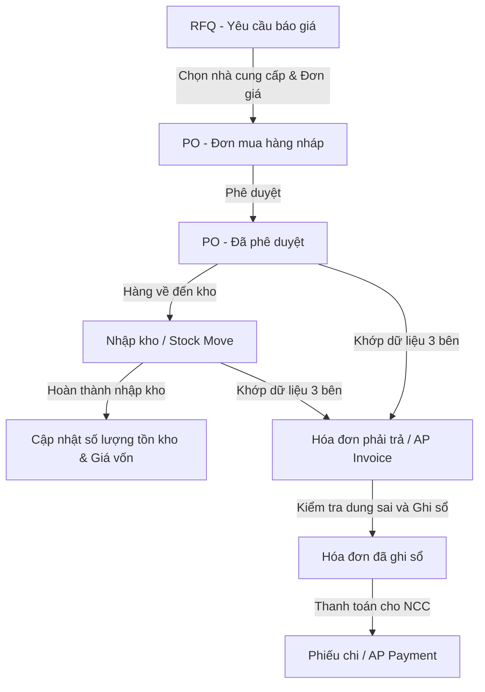

# ERP Mini: Tài Liệu Hướng Dẫn Luồng Nghiệp Vụ & Giải Thích Mã Nguồn (Purchase & Inventory)

Tài liệu này mô tả chi tiết từ luồng nghiệp vụ thực tế đến luồng thực thi trong mã nguồn ở tầng backend cho hai mô-đun **Mua hàng (Purchase)** và **Kho hàng (Inventory)** trong hệ thống ERP Mini. Tài liệu được thiết kế nhằm giúp bạn chuẩn bị tốt nhất cho buổi báo cáo và demo sản phẩm.

---

## 1. Luồng Nghiệp Vụ Tổng Quan (Procure-to-Pay - P2P)

Luồng tích hợp giữa Mua hàng và Kho hàng tuân theo quy trình mua sắm chuẩn trong doanh nghiệp:



### Bước 1: Tìm nguồn cung ứng (RFQ & Bảng giá)
- **Nghiệp vụ**: Nhân viên mua hàng tạo **Yêu cầu báo giá (RFQ)** gửi đến các nhà cung cấp. Sau khi thống nhất giá, thông tin giá được lưu lại trong **Bảng giá mua (Purchase Price List)** để tự động áp dụng giá bán theo số lượng (giá bậc thang) cho các đơn hàng sau.
- **Model liên quan**: `PurchaseRfq`, `PurchaseRfqLine`, `PurchasePriceList`, `PurchasePriceListItem`.

### Bước 2: Đặt hàng (Purchase Order - PO)
- **Nghiệp vụ**: Tạo **Đơn mua hàng (PO)** ở trạng thái nháp (`draft`). Đơn hàng chứa thông tin chi tiết về sản phẩm, số lượng, đơn giá, thuế suất, điều khoản thanh toán và các mức chiết khấu. Đơn hàng cần được phê duyệt bởi Quản lý hoặc Giám đốc trước khi thực hiện các bước tiếp theo.
- **Model liên quan**: `PurchaseOrder`, `PurchaseOrderLine`.

### Bước 3: Nhận hàng vào kho (Goods Receipt Note - GRN)
- **Nghiệp vụ**: Khi hàng về đến kho, thủ kho tạo hoặc xác nhận một phiếu **Nhập kho (Stock Move)** liên kết với đơn mua hàng (`reference_type: 'purchase_order'`). Khi xác nhận hoàn thành phiếu nhập kho này, số lượng hàng tồn kho thực tế (`qty_on_hand`) sẽ tăng lên và giá vốn sản phẩm được cập nhật.
- **Model liên quan**: `StockMove`, `StockMoveLine`, `StockBalance`, `StockLot`.

### Bước 4: Ghi nhận hóa đơn & Khớp 3 bên (AP Invoice & 3-Way Matching)
- **Nghiệp vụ**: Khi nhận được hóa đơn từ nhà cung cấp, kế toán mua hàng nhập hóa đơn vào hệ thống. Hệ thống thực hiện quy trình **Khớp 3 bên**:
  1. **Đơn mua hàng (PO)**: Khớp về đơn giá đã thỏa thuận.
  2. **Phiếu nhập kho (Receipt)**: Khớp về số lượng thực tế đã nhập kho thành công.
  3. **Hóa đơn nhà cung cấp (AP Invoice)**: Số lượng và đơn giá nhà cung cấp yêu cầu thanh toán.
- Hệ thống kiểm tra dung sai chênh lệch. Nếu nằm trong mức cho phép, hóa đơn được phê duyệt và ghi sổ.
- **Model liên quan**: `ApInvoice`, `ApInvoiceLine`, `MatchingTolerance`.

### Bước 5: Thanh toán (AP Payment)
- **Nghiệp vụ**: Kế toán lập phiếu chi (Thanh toán AP) để thanh toán cho nhà cung cấp, tất toán công nợ phải trả.
- **Model liên quan**: `ApPayment`, `ApPaymentLine`.

---

## 2. Giải Thích Chi Tiết Mã Nguồn Backend

### A. Tính Toán Đơn Hàng & Phân Bổ Chiết Khấu
**File**: [purchaseOrder.service.ts](file:///d:/WorkSpace/TLCN/ERP-MINI/erp-backend/src/modules/purchase/services/purchaseOrder.service.ts)

Khi một PO được lưu, backend tự động tính toán tổng tiền hàng, thuế VAT và phân bổ chiết khấu tổng đơn vào từng dòng sản phẩm.

#### 1. Tính toán giá trị từng dòng hàng (Line Item)
Phương thức `calculateLine` tính tổng tiền chưa thuế của từng dòng sản phẩm và trừ đi chiết khấu của dòng đó (nếu có):
```typescript
async calculateLine(line: any) {
  const taxRate = line.tax_rate_id ? await TaxRate.findByPk(line.tax_rate_id) : null;
  const rate = taxRate ? Number(taxRate.rate) : 0;
  
  const grossTotal = Number(line.quantity) * Number(line.unit_price);
  
  let discountAmount = 0;
  let discountPercent = 0;

  // Tính chiết khấu riêng của dòng hàng đó
  if (line.discount_type === "fixed") {
    discountAmount = Number(line.discount_amount || 0);
    discountPercent = grossTotal > 0 ? (discountAmount / grossTotal) * 100 : 0;
  } else {
    discountPercent = Number(line.discount_percent || 0);
    discountAmount = grossTotal * (discountPercent / 100);
  }

  const lineTotal = grossTotal - discountAmount;
  const lineTax = (lineTotal * rate) / 100;
  const lineTotalAfterTax = lineTotal + lineTax;

  return {
    line_total: lineTotal,
    line_tax: lineTax,
    line_total_after_tax: lineTotalAfterTax,
    discount_amount: discountAmount,
    discount_percent: discountPercent,
  };
}
```

#### 2. Phân bổ chiết khấu tổng đơn theo tỷ lệ trọng số
Đặc biệt, nếu đơn hàng có chiết khấu tổng đơn (ví dụ giảm giá 2% trên tổng hóa đơn), số tiền giảm giá này sẽ được **phân bổ theo tỷ trọng giá trị** vào từng dòng hàng. Điều này giúp tính toán chính xác giá trị nhập kho của từng loại hàng (giá trị thực tế sau khi giảm trừ):
```typescript
// 1. Xác định tổng tiền chiết khấu tổng đơn (header discount)
let headerDiscountAmount = 0;
let headerDiscountPercent = 0;
if (data.discount_type === "fixed") {
  headerDiscountAmount = Number(data.discount_amount || 0);
  headerDiscountPercent = totalBeforeHeaderDiscount > 0
    ? (headerDiscountAmount / totalBeforeHeaderDiscount) * 100
    : 0;
} else {
  headerDiscountPercent = Number(data.discount_percent || 0);
  headerDiscountAmount = totalBeforeHeaderDiscount * (headerDiscountPercent / 100);
}

// 2. Phân bổ chiết khấu tổng đơn vào từng dòng sản phẩm
for (const item of calculatedLines) {
  const line = item.line;
  const calc = item.calc;

  // Tính tỷ trọng đóng góp của dòng hàng này trên tổng đơn hàng
  const weight = totalBeforeHeaderDiscount > 0 ? (calc.line_total / totalBeforeHeaderDiscount) : 0;
  const distributedDiscount = headerDiscountAmount * weight;

  // Giá trị thực tế của dòng sau khi trừ chiết khấu dòng và chiết khấu tổng đơn phân bổ
  const netLineTotal = calc.line_total - distributedDiscount;
  const lineTax = (netLineTotal * rate) / 100; // Thuế tính trên giá trị thực tế sau chiết khấu
  const lineTotalAfterTax = netLineTotal + lineTax;

  totalBeforeTax += netLineTotal;
  totalTax += lineTax;
  totalAfterTax += lineTotalAfterTax;
  
  // Lưu vào database PurchaseOrderLine...
}
```

---

### B. Nghiệp Vụ Xác Nhận Nhập Kho & Định Giá Tồn Kho
**File**: [stockMove.service.ts](file:///d:/WorkSpace/TLCN/ERP-MINI/erp-backend/src/modules/inventory/services/stockMove.service.ts)

Khi thủ kho xác nhận hoàn thành phiếu nhập kho (`confirm`), hệ thống sẽ cập nhật số lượng tồn kho thực tế và tính toán giá trị hàng hóa nhập kho dựa trên giá thực tế của PO.

#### 1. Lấy đơn giá thực tế từ PO làm giá vốn nhập kho
Khi ghi nhận nhập kho từ một PO, hệ thống sẽ ánh xạ đơn giá trên dòng PO để xác định giá vốn cho lô hàng nhập kho đó:
```typescript
if (move.reference_type === "purchase_order" && move.reference_id) {
  const poLine = await PurchaseOrderLine.findOne({
    where: { po_id: move.reference_id, product_id: item.product_id },
  });
  if (poLine && qtyInStockUom > 0) {
    // Giá vốn nhập kho mỗi đơn vị = (Đơn giá PO * Số lượng PO) / Số lượng quy đổi trong kho
    unitCost = (Number(poLine.unit_price) * qtyInPurchaseUom) / qtyInStockUom;
  }
}
```

#### 2. Ghi sổ kho (Stock Ledger)
Mỗi lần nhập/xuất kho, hệ thống đều tạo một bản ghi lịch sử kho hàng (`StockLedger`) để phục vụ báo cáo thẻ kho và định giá tồn kho:
```typescript
await StockLedger.create({
  product_id: item.product_id,
  location_id: move.dest_location_id,
  qty_change: qtyInStockUom, // Số dương cho nhập kho, số âm cho xuất kho
  unit_cost: unitCost,
  reference_type: move.reference_type, // 'purchase_order'
  reference_id: move.reference_id,
  move_line_id: item.id,
}, { transaction: t });
```

#### 3. Đồng bộ trạng thái nhận hàng của PO
Sau khi xác nhận nhập kho thành công, hệ thống tính toán lại số lượng đã nhận để cập nhật trạng thái nhận hàng của PO (`receipt_status`):
- Nếu nhận đủ: `fully_received`
- Nếu nhận một phần: `partially_received`

---

### C. Cơ Chế Khớp 3 Bên & Kiểm Tra Dung Sai Hóa Đơn
**File**: [apInvoice.service.ts](file:///d:/WorkSpace/TLCN/ERP-MINI/erp-backend/src/modules/purchase/services/apInvoice.service.ts)

Trước khi hóa đơn mua hàng (AP Invoice) được ghi sổ để tạo công nợ, hệ thống sẽ thực hiện đối soát tự động:

```typescript
// Lấy cấu hình dung sai chênh lệch giá trị và số lượng cho phép của hệ thống
const matchTolerance = await MatchingTolerance.findOne({ where: { is_active: true } });
const priceTolerancePct = matchTolerance ? Number(matchTolerance.price_tolerance_pct) : 0;

for (const line of invoiceLines) {
  // Tìm dòng sản phẩm tương ứng trong PO để đối chiếu giá
  const poLine = await PurchaseOrderLine.findOne({ where: { po_id, product_id: line.product_id } });
  const poPrice = Number(poLine.unit_price);
  const invPrice = Number(line.unit_price);
  
  // Tính tỷ lệ chênh lệch giá bán của hóa đơn so với PO ban đầu
  const priceDiffPct = ((invPrice - poPrice) / poPrice) * 100;
  if (priceDiffPct > priceTolerancePct) {
    throw new Error(`Đơn giá sản phẩm ${line.product_name} vượt quá dung sai cho phép so với PO!`);
  }
}
```

---

## 3. Kịch Bản Từng Bước Demo (Demo Flow) Cho Buổi Trình Bày

Dưới đây là kịch bản demo chạy thực tế trên hệ thống để bạn trình diễn:

### Bước 1: Tạo Đơn Mua Hàng Bằng Trợ Lý AI Chatbot
- **Thao tác**: Mở khung chat AI Chatbot trên giao diện ERP.
- **Nhập câu lệnh**: `Tạo đơn mua hàng 5 chiếc iPhone 15 Pro Max từ ABC Supplies Ltd. Chiết khấu 1% cho dòng sản phẩm và 2% cho tổng đơn. Điều khoản thanh toán 60 ngày.`
- **Giải thích luồng**: 
  - Chatbot nhận biết ý định tạo đơn hàng $\rightarrow$ Gọi tool tìm kiếm đối tác để lấy `supplier_id` từ tên "ABC Supplies Ltd".
  - Gọi tool tìm kiếm sản phẩm để lấy `product_id` cho "iPhone 15 Pro Max".
  - Thực hiện tính toán chiết khấu 1% cho dòng sản phẩm và 2% chiết khấu tổng đơn như yêu cầu.
  - Hiển thị hộp thoại **Xác nhận thao tác** với đầy đủ thông tin tính toán chiết khấu và tổng cộng trước khi tạo đơn nháp.
- **Thao tác tiếp theo**: Nhấn nút **Xác nhận** hoặc gõ `đồng ý` để hoàn tất tạo đơn nháp.

### Bước 2: Phê Duyệt Đơn Mua Hàng (PO Approval)
- **Thao tác**: Vào màn hình quản lý đơn mua hàng (Purchase Orders). Tìm đơn hàng vừa tạo ở trạng thái **Nháp (Draft)**.
- **Thao tác tiếp theo**: Nhấp chọn đơn hàng, chọn **Gửi duyệt (Submit for Approval)**, sau đó nhấp **Phê duyệt (Approve)** (dùng tài khoản quyền `ADMIN` hoặc `CEO`).
- **Giải thích**: Trạng thái PO chuyển thành `Confirmed` (Đã xác nhận), lúc này đơn hàng đã sẵn sàng cho việc nhận hàng và đối soát hóa đơn.

### Bước 3: Nhập Kho Hàng Hóa (Goods Receipt)
- **Thao tác**: Vào menu **Kho hàng > Phiếu nhập kho (Stock Moves)**.
- **Thao tác tiếp theo**: Bạn sẽ thấy một phiếu nhập kho dạng chờ xử lý liên kết với mã PO vừa phê duyệt. Chọn phiếu này và nhấp **Xác nhận nhập kho (Confirm Receipt)**.
- **Giải thích**: 
  - Hàng hóa chính thức được ghi tăng số lượng trong kho.
  - Giá vốn nhập kho của iPhone được tính toán chính xác sau khi đã trừ đi 1% chiết khấu dòng và 2% chiết khấu tổng đơn phân bổ.
  - Trạng thái nhận hàng của PO tự động chuyển thành **Đã nhận đủ (fully_received)**.

### Bước 4: Tạo Hóa Đơn Nhà Cung Cấp & Kiểm Tra Dung Sai (3-Way Matching)
- **Thao tác**: Vào màn hình **Hóa đơn mua hàng (AP Invoices)**. Tạo hóa đơn mới liên kết với PO này.
- **Thử nghiệm lỗi**: Sửa đơn giá iPhone trên hóa đơn tăng lên 15% so với giá PO gốc. Nhấn **Ghi sổ (Post)**.
  - **Kết quả**: Hệ thống sẽ hiển thị thông báo lỗi cảnh báo vượt quá dung sai chênh lệch đơn giá cho phép (do cấu hình tolerance thường là 5% hoặc 10%).
- **Thao tác sửa**: Sửa đơn giá hóa đơn về đúng giá PO, nhấn **Ghi sổ (Post)**. Hệ thống sẽ ghi sổ thành công, sẵn sàng cho việc lập phiếu chi thanh toán ở bước tiếp theo.
