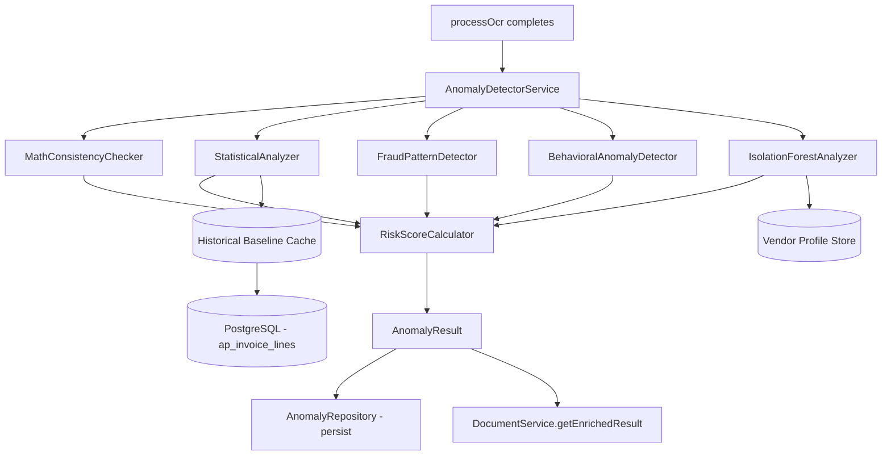

# Tài Liệu Thiết Kế: Hệ Thống Phát Hiện Bất Thường OCR (OCR Anomaly Detection)

## Tổng Quan

Module này bổ sung một lớp phân tích bất thường (Anomaly Detection Layer) vào quy trình OCR hiện tại của `document-intelligence`. Sau khi `processOcr` hoàn thành thành công, hệ thống sẽ tự động phân tích kết quả OCR để phát hiện các bất thường về giá, số lượng, toán học, hành vi gian lận, và outlier đa chiều — trả về một `Anomaly_Result` với `Risk_Score` tổng hợp trước khi người dùng xác nhận hóa đơn.

### Mục Tiêu

- Phát hiện sớm các hóa đơn đáng ngờ trước khi xác nhận
- Không làm gián đoạn quy trình OCR hiện tại (fail-safe)
- Hoàn thành phân tích trong vòng 2000ms
- Hỗ trợ cấu hình ngưỡng theo từng branch

### Phạm Vi Tích Hợp

Tính năng này tích hợp vào quy trình hiện tại tại điểm sau `processOcr`:

```
upload → processOcr → [ANOMALY DETECTION] → getEnrichedResult → confirmDocument
```

---

## Kiến Trúc

### Sơ Đồ Tổng Thể



### Nguyên Tắc Thiết Kế

1. **Fail-safe**: Nếu bất kỳ analyzer nào gặp lỗi, pipeline OCR vẫn tiếp tục bình thường
2. **Độc lập**: Mỗi analyzer hoạt động độc lập, không chia sẻ trạng thái có thể gây race condition
3. **Caching**: `StatisticalAnalyzer` cache `VendorProfile` trong bộ nhớ với TTL 5 phút
4. **Timeout graceful**: Nếu truy vấn DB > 1000ms, bỏ qua phân tích thống kê, chỉ trả về kết quả toán học và quy tắc nghiệp vụ
5. **Immutable history**: Mỗi lần phân tích tạo bản ghi mới, không ghi đè

---

## Các Thành Phần và Giao Diện

### 1. AnomalyDetectorService (Điều Phối Chính)

```typescript
// erp-backend/src/modules/document-intelligence/services/anomalyDetector.service.ts

export class AnomalyDetectorService {
  constructor(
    private readonly mathChecker: MathConsistencyChecker,
    private readonly statisticalAnalyzer: StatisticalAnalyzer,
    private readonly fraudDetector: FraudPatternDetector,
    private readonly behavioralDetector: BehavioralAnomalyDetector,
    private readonly isolationForest: IsolationForestAnalyzer,
    private readonly riskCalculator: RiskScoreCalculator,
    private readonly config: ThresholdConfigService,
  ) {}

  async analyze(
    ocrData: OcrInvoiceData,
    documentId: number,
    branchId: number,
    processingDate: Date,
  ): Promise<AnomalyResult>;
}
```

**Trách nhiệm**: Điều phối tất cả các analyzer, tổng hợp flags, tính Risk_Score, đảm bảo timeout.

### 2. MathConsistencyChecker

```typescript
// erp-backend/src/modules/document-intelligence/services/anomaly/mathConsistency.checker.ts

export class MathConsistencyChecker {
  check(ocrData: OcrInvoiceData): AnomalyFlag[];
}
```

**Trách nhiệm**: Kiểm tra tính nhất quán toán học (subtotal, total, line amounts). Không cần DB.

### 3. StatisticalAnalyzer

```typescript
// erp-backend/src/modules/document-intelligence/services/anomaly/statistical.analyzer.ts

export class StatisticalAnalyzer {
  async analyzePrices(
    items: OcrLineItem[],
    vendorTaxCode: string,
    branchId: number,
    config: ThresholdConfig,
  ): Promise<AnomalyFlag[]>;

  async analyzeQuantities(
    items: OcrLineItem[],
    vendorTaxCode: string,
    branchId: number,
    config: ThresholdConfig,
  ): Promise<AnomalyFlag[]>;

  // Internal: cached vendor profile lookup
  private async getVendorProfile(
    vendorTaxCode: string,
    productName: string,
    branchId: number,
  ): Promise<VendorProfile | null>;
}
```

**Trách nhiệm**: Z-score và IQR analysis cho giá và số lượng. Sử dụng in-memory cache với TTL 5 phút.

### 4. FraudPatternDetector

```typescript
// erp-backend/src/modules/document-intelligence/services/anomaly/fraudPattern.detector.ts

export class FraudPatternDetector {
  async detect(
    ocrData: OcrInvoiceData,
    branchId: number,
    config: ThresholdConfig,
  ): Promise<AnomalyFlag[]>;
}
```

**Trách nhiệm**: Phát hiện các mẫu gian lận (approval threshold proximity, high frequency, round numbers, rejected patterns, period-end spikes).

### 5. BehavioralAnomalyDetector

```typescript
// erp-backend/src/modules/document-intelligence/services/anomaly/behavioral.detector.ts

export class BehavioralAnomalyDetector {
  async detect(
    ocrData: OcrInvoiceData,
    branchId: number,
    processingDate: Date,
  ): Promise<AnomalyFlag[]>;
}
```

**Trách nhiệm**: Phát hiện bất thường hành vi (new vendor, dormant vendor, weekend invoices, future dates, stale invoices, tax code changes).

### 6. IsolationForestAnalyzer

```typescript
// erp-backend/src/modules/document-intelligence/services/anomaly/isolationForest.analyzer.ts

export class IsolationForestAnalyzer {
  async analyze(
    ocrData: OcrInvoiceData,
    vendorTaxCode: string,
    branchId: number,
  ): Promise<AnomalyFlag[]>;

  async updateModel(vendorTaxCode: string, branchId: number): Promise<void>;
}
```

**Trách nhiệm**: Phân tích outlier đa chiều. Sử dụng thuật toán Isolation Forest thuần TypeScript (không cần thư viện ML nặng).

### 7. RiskScoreCalculator

```typescript
// erp-backend/src/modules/document-intelligence/services/anomaly/riskScore.calculator.ts

export class RiskScoreCalculator {
  calculate(flags: AnomalyFlag[], config: ThresholdConfig): RiskScoreResult;
}
```

**Trách nhiệm**: Tính Risk_Score từ danh sách flags theo công thức trọng số, phân loại risk level.

### 8. ThresholdConfigService

```typescript
// erp-backend/src/modules/document-intelligence/services/anomaly/thresholdConfig.service.ts

export class ThresholdConfigService {
  async getConfig(branchId: number): Promise<ThresholdConfig>;
  async updateConfig(
    branchId: number,
    params: Partial<ThresholdConfig>,
  ): Promise<ThresholdConfig>;
}
```

**Trách nhiệm**: Quản lý cấu hình ngưỡng theo branch, validate giá trị, fallback về default.

### 9. AnomalyRepository

```typescript
// erp-backend/src/modules/document-intelligence/services/anomaly/anomaly.repository.ts

export class AnomalyRepository {
  async save(
    documentId: number,
    result: AnomalyResult,
  ): Promise<InvoiceAnomalyResult>;
  async findByDocumentId(documentId: number): Promise<InvoiceAnomalyResult[]>;
  async findHighRisk(
    branchId: number,
    filters: AnomalyQueryFilters,
  ): Promise<PaginatedResult<InvoiceAnomalyResult>>;
  async getStatsByBranch(
    branchId: number,
    dateRange: DateRange,
  ): Promise<BranchAnomalyStats>;
  async recordOverride(documentId: number, userId: number): Promise<void>;
}
```

---

## Mô Hình Dữ Liệu

### Types Mới (anomaly.types.ts)

```typescript
// erp-backend/src/modules/document-intelligence/types/anomaly.types.ts

export type AnomalySeverity = "low" | "medium" | "high" | "critical";
export type RiskLevel = "low_risk" | "medium_risk" | "high_risk";

export type AnomalyFlagType =
  | "price_outlier_zscore"
  | "price_outlier_iqr"
  | "quantity_outlier_zscore"
  | "quantity_outlier_5x"
  | "invalid_quantity"
  | "subtotal_mismatch"
  | "total_mismatch"
  | "line_amount_mismatch"
  | "approval_threshold_proximity"
  | "high_frequency_invoicing"
  | "round_number_no_detail"
  | "rejected_pattern_match"
  | "period_end_spike"
  | "new_vendor"
  | "dormant_vendor_reactivation"
  | "weekend_high_value"
  | "future_dated_invoice"
  | "stale_invoice"
  | "vendor_tax_code_change"
  | "multivariate_outlier"
  | "insufficient_data";

export interface AnomalyFlag {
  type: AnomalyFlagType;
  severity: AnomalySeverity;
  description: string;
  lineItemIndex?: number; // index trong items[], nếu liên quan đến line item cụ thể
  metadata?: Record<string, any>; // dữ liệu bổ sung (mean, std, deviation%, v.v.)
}

export interface AnomalyResult {
  flags: AnomalyFlag[];
  risk_score: number; // [0.0, 1.0]
  risk_level: RiskLevel;
  math_consistent: boolean;
  analyzed_at: Date;
  analysis_duration_ms: number;
  skipped_reasons?: string[]; // lý do bỏ qua một số phân tích (insufficient_data, timeout, v.v.)
}

export interface VendorProfile {
  vendorTaxCode: string;
  productName: string;
  branchId: number;
  priceStats: {
    mean: number;
    std: number;
    q1: number;
    q3: number;
    iqr: number;
    count: number;
  };
  quantityStats: {
    mean: number;
    std: number;
    q1: number;
    q3: number;
    iqr: number;
    count: number;
  };
  cachedAt: Date;
}

export interface ThresholdConfig {
  branchId: number;
  zScoreThreshold: number; // default: 3.0, range: [1.0, 10.0]
  iqrMultiplier: number; // default: 1.5, range: [0.5, 5.0]
  frequencyThresholdPerHour: number; // default: 3, range: [1, 100]
  approvalThresholdVnd: number; // default: 0 (disabled)
  highRiskScoreThreshold: number; // default: 0.7, range: [0.1, 1.0]
  mediumRiskScoreThreshold: number; // default: 0.4, range: [0.1, 1.0]
}

export interface RiskScoreResult {
  score: number;
  level: RiskLevel;
}
```

### Model Database Mới: InvoiceAnomalyResult

```typescript
// erp-backend/src/modules/document-intelligence/models/invoiceAnomalyResult.model.ts

export interface InvoiceAnomalyResultAttrs {
  id: number;
  document_id: number;
  risk_score: number;
  risk_level: "low_risk" | "medium_risk" | "high_risk";
  flags: AnomalyFlag[]; // lưu dưới dạng JSONB
  math_consistent: boolean;
  skipped_reasons: string[]; // JSONB
  analysis_duration_ms: number;
  analyzed_at: Date;
  override_by?: number | null; // user_id nếu bị override
  override_at?: Date | null;
  created_at?: Date;
}
```

**Bảng**: `invoice_anomaly_results`

**Indexes**:

- `(document_id)` — tra cứu theo tài liệu
- `(branch_id, analyzed_at)` — truy vấn lịch sử theo branch và thời gian (join qua invoice_documents)
- `(risk_score DESC)` — sắp xếp theo risk score

### Model Database Mới: AnomalyThresholdConfig

```typescript
// erp-backend/src/modules/document-intelligence/models/anomalyThresholdConfig.model.ts

export interface AnomalyThresholdConfigAttrs {
  id: number;
  branch_id: number; // UNIQUE
  z_score_threshold: number;
  iqr_multiplier: number;
  frequency_threshold_per_hour: number;
  approval_threshold_vnd: number;
  high_risk_score_threshold: number;
  medium_risk_score_threshold: number;
  created_by: number;
  updated_by: number;
  created_at?: Date;
  updated_at?: Date;
}
```

**Bảng**: `anomaly_threshold_configs`

### Thay Đổi Model Hiện Có: InvoiceDocument

Thêm cột `anomaly_result` (JSONB, nullable) vào bảng `invoice_documents` để lưu snapshot kết quả phân tích mới nhất (denormalized cho performance):

```typescript
anomaly_result?: AnomalyResult | null;
```

---

## Correctness Properties

_A property is a characteristic or behavior that should hold true across all valid executions of a system — essentially, a formal statement about what the system should do. Properties serve as the bridge between human-readable specifications and machine-verifiable correctness guarantees._

### Property 1: Risk Score Bounds Invariant

_For any_ tập hợp Anomaly_Flag với bất kỳ severity nào, Risk_Score được tính toán SHALL luôn nằm trong khoảng [0.0, 1.0].

**Validates: Requirements 7.1, 7.2, 11.3**

---

### Property 2: Risk Level Classification

_For any_ Risk_Score được tính toán, risk_level SHALL được phân loại chính xác: `high_risk` khi score >= 0.7, `medium_risk` khi score trong [0.4, 0.7), và `low_risk` khi score < 0.4.

**Validates: Requirements 7.3, 7.4, 7.5**

---

### Property 3: Mathematical Consistency Detection

_For any_ OcrInvoiceData mà tổng line amounts lệch so với subtotal quá 0.01 VND, hoặc subtotal + tax_amount lệch so với total quá 0.01 VND, hoặc qty × unit_price lệch so với line amount quá 0.01 VND, SHALL có ít nhất một Anomaly_Flag tương ứng trong kết quả.

**Validates: Requirements 3.2, 3.4, 3.5**

---

### Property 4: Math Consistent Flag

_For any_ OcrInvoiceData mà tất cả các kiểm tra toán học đều nhất quán (chênh lệch <= 0.01 VND), `math_consistent` trong Anomaly_Result SHALL bằng `true` và không có flag nào thuộc loại `subtotal_mismatch`, `total_mismatch`, hoặc `line_amount_mismatch`.

**Validates: Requirements 3.6**

---

### Property 5: Insufficient Data Skipping

_For any_ tập lịch sử giao dịch có ít hơn 5 bản ghi cho một sản phẩm/nhà cung cấp, SHALL không có Anomaly_Flag nào thuộc loại `price_outlier_zscore`, `price_outlier_iqr`, `quantity_outlier_zscore`, hoặc `quantity_outlier_5x` được tạo ra cho sản phẩm đó.

**Validates: Requirements 1.5, 2.5**

---

### Property 6: Invalid Quantity Detection

_For any_ OcrLineItem có qty <= 0, SHALL có Anomaly_Flag với loại `invalid_quantity` và severity `critical` trong kết quả.

**Validates: Requirements 2.4**

---

### Property 7: Statistical Severity Ordering

_For any_ đơn giá có Z-score vượt ngưỡng, severity của flag SHALL tương ứng với mức độ lệch: `high` khi Z-score > zScoreThreshold, và `critical` khi giá trị nằm ngoài [Q1 - 3.0×IQR, Q3 + 3.0×IQR].

**Validates: Requirements 1.2, 1.3, 1.4**

---

### Property 8: Anomaly Result Serialization Round-Trip

_For any_ AnomalyResult hợp lệ, quá trình serialize sang JSON rồi deserialize SHALL tạo ra một đối tượng tương đương với đối tượng gốc (tất cả flags, risk_score, risk_level, math_consistent đều được bảo toàn).

**Validates: Requirements 11.1, 11.2**

---

### Property 9: Flag Uniqueness

_For any_ OcrInvoiceData, danh sách Anomaly_Flag trong kết quả SHALL không chứa hai flags có cùng `type` và cùng `lineItemIndex` (hoặc cả hai đều không có lineItemIndex).

**Validates: Requirements 11.4**

---

### Property 10: Empty Items Produces Empty Result

_For any_ OcrInvoiceData với danh sách items rỗng và các trường số học nhất quán, Anomaly_Result SHALL có danh sách flags rỗng (hoặc chỉ chứa behavioral flags không liên quan đến items) và Risk_Score bằng 0.0 nếu không có behavioral flags.

**Validates: Requirements 11.5**

---

### Property 11: Threshold Config Validation

_For any_ giá trị cấu hình nằm ngoài khoảng hợp lệ (Z-score < 1.0 hoặc > 10.0, IQR multiplier < 0.5 hoặc > 5.0, high_risk_threshold < 0.1 hoặc > 1.0), ThresholdConfigService SHALL từ chối cập nhật và trả về lỗi mô tả khoảng hợp lệ.

**Validates: Requirements 10.4**

---

### Property 12: Default Config Fallback

_For any_ branchId không có cấu hình tùy chỉnh, ThresholdConfigService SHALL trả về giá trị mặc định: zScoreThreshold = 3.0, iqrMultiplier = 1.5, frequencyThresholdPerHour = 3, approvalThresholdVnd = 0, highRiskScoreThreshold = 0.7.

**Validates: Requirements 10.2**

---

### Property 13: High Risk Warning Propagation

_For any_ AnomalyResult có risk_level = `high_risk`, khi tích hợp vào OcrInvoiceData, mảng `warnings` SHALL chứa chuỗi `high_risk_anomaly`.

**Validates: Requirements 8.5**

---

## Xử Lý Lỗi

### Chiến Lược Fail-Safe

```typescript
// Trong AnomalyDetectorService.analyze()
async analyze(...): Promise<AnomalyResult> {
  const startTime = Date.now();
  const allFlags: AnomalyFlag[] = [];
  const skippedReasons: string[] = [];

  // 1. Math check — luôn chạy, không có DB dependency
  try {
    const mathFlags = this.mathChecker.check(ocrData);
    allFlags.push(...mathFlags);
  } catch (err) {
    logger.error('MathConsistencyChecker failed', err);
    skippedReasons.push('math_check_error');
  }

  // 2. Statistical analysis — có timeout
  try {
    const statsFlags = await Promise.race([
      this.statisticalAnalyzer.analyzePrices(...),
      timeout(1000, 'statistical_timeout'),
    ]);
    allFlags.push(...statsFlags);
  } catch (err) {
    if (err.message === 'statistical_timeout') {
      skippedReasons.push('statistical_timeout');
    } else {
      logger.error('StatisticalAnalyzer failed', err);
      skippedReasons.push('statistical_error');
    }
  }

  // 3-5. Các analyzer khác tương tự...

  const riskResult = this.riskCalculator.calculate(allFlags, config);
  return {
    flags: allFlags,
    risk_score: riskResult.score,
    risk_level: riskResult.level,
    math_consistent: !allFlags.some(f => ['subtotal_mismatch', 'total_mismatch', 'line_amount_mismatch'].includes(f.type)),
    analyzed_at: new Date(),
    analysis_duration_ms: Date.now() - startTime,
    skipped_reasons: skippedReasons,
  };
}
```

### Xử Lý Lỗi trong DocumentService

```typescript
// Trong DocumentService.processOcr() — sau khi OCR done
try {
  const anomalyResult = await this.anomalyDetector.analyze(
    parsedResult,
    doc.id,
    doc.branch_id,
    new Date(),
  );
  await doc.update({ anomaly_result: anomalyResult });
  await this.anomalyRepository.save(doc.id, anomalyResult);

  // Thêm warning nếu high risk
  if (anomalyResult.risk_level === "high_risk") {
    parsedResult.warnings.push("high_risk_anomaly");
  }
} catch (anomalyErr) {
  // Không làm gián đoạn pipeline OCR
  logger.error(
    `Anomaly detection failed for document ${doc.id}: ${anomalyErr.message}`,
  );
}
```

### Mã Lỗi API

| Mã lỗi                     | HTTP Status | Mô tả                                      |
| -------------------------- | ----------- | ------------------------------------------ |
| `THRESHOLD_INVALID_ZSCORE` | 400         | Z-score threshold ngoài khoảng [1.0, 10.0] |
| `THRESHOLD_INVALID_IQR`    | 400         | IQR multiplier ngoài khoảng [0.5, 5.0]     |
| `THRESHOLD_INVALID_RISK`   | 400         | Risk threshold ngoài khoảng [0.1, 1.0]     |
| `ANOMALY_RESULT_NOT_FOUND` | 404         | Không tìm thấy kết quả phân tích           |
| `DOCUMENT_NOT_ANALYZED`    | 400         | Tài liệu chưa được phân tích bất thường    |

---

## Chiến Lược Kiểm Thử

### Phương Pháp Kiểm Thử Kép

Tính năng này sử dụng kết hợp:

- **Unit tests**: Kiểm tra các ví dụ cụ thể, edge cases, và error conditions
- **Property-based tests**: Kiểm tra các thuộc tính phổ quát trên nhiều đầu vào ngẫu nhiên

### Cấu Trúc Thư Mục Test

```
erp-backend/src/modules/document-intelligence/__tests__/
├── properties/
│   └── anomalyDetection.properties.test.ts   # Property-based tests
├── unit/
│   ├── mathConsistency.checker.test.ts
│   ├── riskScore.calculator.test.ts
│   ├── thresholdConfig.service.test.ts
│   └── statisticalAnalyzer.test.ts
└── integration/
    └── anomalyPipeline.integration.test.ts
```

### Property-Based Tests (Vitest + fast-check)

Thư viện: **fast-check** (đã có trong devDependencies)
Cấu hình: Tối thiểu **100 iterations** mỗi property test.

Mỗi property test được tag theo format:
`Feature: ocr-anomaly-detection, Property {N}: {property_text}`

**File**: `anomalyDetection.properties.test.ts`

Các property cần implement:

- **Property 1**: Risk Score Bounds Invariant — generate random flag sets, verify score in [0.0, 1.0]
- **Property 2**: Risk Level Classification — generate scores, verify correct level assignment
- **Property 3**: Mathematical Consistency Detection — generate inconsistent invoices, verify flags
- **Property 4**: Math Consistent Flag — generate consistent invoices, verify math_consistent = true
- **Property 5**: Insufficient Data Skipping — generate < 5 historical records, verify no statistical flags
- **Property 6**: Invalid Quantity Detection — generate qty <= 0, verify critical flag
- **Property 7**: Statistical Severity Ordering — generate prices with known Z-scores, verify severity
- **Property 8**: Serialization Round-Trip — generate AnomalyResult, serialize/deserialize, verify equivalence
- **Property 9**: Flag Uniqueness — generate inputs that could produce duplicates, verify deduplication
- **Property 10**: Empty Items Produces Empty Result — generate empty items with consistent math, verify empty flags
- **Property 11**: Threshold Config Validation — generate invalid config values, verify rejection
- **Property 12**: Default Config Fallback — generate branch IDs without config, verify defaults
- **Property 13**: High Risk Warning Propagation — generate high-risk results, verify warning added

### Unit Tests

- `MathConsistencyChecker`: Test từng loại mismatch với giá trị cụ thể
- `RiskScoreCalculator`: Test công thức trọng số với các tổ hợp severity
- `ThresholdConfigService`: Test validation và fallback
- `StatisticalAnalyzer`: Test Z-score và IQR với dữ liệu đã biết

### Integration Tests

- Pipeline end-to-end: OCR done → anomaly detection → persist → getEnrichedResult
- Performance: Phân tích 50 line items trong < 2000ms
- Concurrency: Nhiều hóa đơn đồng thời không gây race condition

### Smoke Tests

- Verify indexes tồn tại trên `invoice_anomaly_results`
- Verify migration chạy thành công
