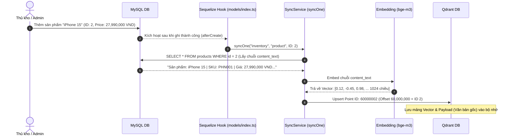
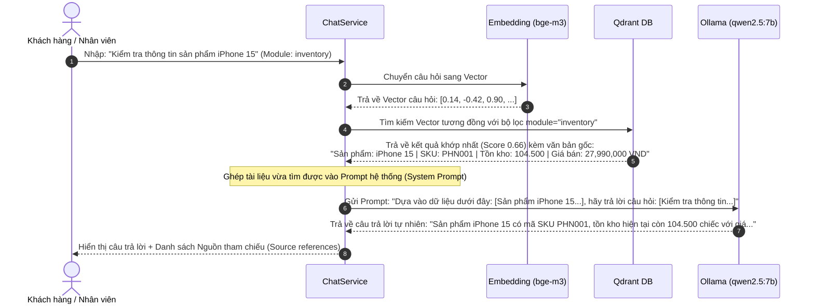

# TÀI LIỆU KIẾN TRÚC & HƯỚNG DẪN VẬN HÀNH HỆ THỐNG LOCAL RAG (AI CHATBOT)
---

Tài liệu này cung cấp cái nhìn chi tiết và toàn diện nhất về hệ thống **Local RAG (Retrieval-Augmented Generation)** được tích hợp trong hệ thống ERP Mini.

---

## 1. HẠ TẦNG & CÁC CÔNG CỤ BỔ TRỢ (DOCKER, OLLAMA, QDRANT)

Để chạy được hệ thống AI hoàn toàn cục bộ (Local), hệ thống sử dụng ba thành phần hạ tầng cốt lõi: **Docker**, **Ollama**, và **Qdrant**.

### 🐳 A. Docker dùng để làm gì?
* **Khái niệm**: Docker giống như một "hộp vận chuyển hàng hóa ảo". Nó đóng gói toàn bộ môi trường chạy của một phần mềm (bao gồm hệ điều hành thu nhỏ, thư viện, cấu hình) thành một container độc lập.
* **Tại sao phải dùng trong dự án này?**
  * Thay vì bắt bạn phải lên mạng tải MySQL, Qdrant về rồi cài đặt thủ công vào Windows (cấu hình biến môi trường, xung đột cổng mạng, lỗi hệ điều hành), Docker cho phép khởi chạy mọi dịch vụ này chỉ bằng một dòng lệnh duy nhất.
  * Giúp các dịch vụ chạy biệt lập, không làm ảnh hưởng đến hệ điều hành Windows của bạn.

### 🦙 B. Cài Ollama để làm gì?
* **Khái niệm**: Ollama là một công cụ quản lý và chạy các **Mô hình Trí tuệ nhân tạo (LLMs)** trực tiếp trên máy tính cá nhân của bạn mà không cần kết nối Internet.
* **Vai trò trong dự án**:
  * **Chạy mô hình ngôn ngữ lớn `qwen2.5:7b`**: Chịu trách nhiệm đọc hiểu văn bản, suy luận và viết câu trả lời bằng tiếng Việt chuyên nghiệp gửi tới người dùng.
  * **Chạy mô hình mã hóa `bge-m3`**: Chuyển đổi các chuỗi văn bản thông thường thành các mảng số thực (Vectors) đại diện cho ý nghĩa của từ ngữ.

### 🔍 C. Qdrant chạy để làm gì?
* **Khái niệm**: Qdrant là một **Cơ sở dữ liệu Vector (Vector Database)** chuyên dụng.
* **Tại sao MySQL không tự làm được việc này?**
  * MySQL chỉ hiểu các phép so sánh tuyệt đối hoặc gần đúng đơn giản như `WHERE name LIKE '%iPhone%'`. Nó **không hiểu nghĩa** của từ ngữ.
  * Qdrant lưu trữ các thông tin dưới dạng các điểm vector đa chiều. Khi bạn hỏi *"Điện thoại Apple giá bao nhiêu?"*, Qdrant có khả năng tìm ra bản ghi *"Sản phẩm: iPhone 15"* vì nó hiểu *"Điện thoại"* và *"iPhone"* có mối quan hệ ngữ nghĩa gần nhau trong không gian vector toán học.
  * Qdrant hỗ trợ tìm kiếm hàng triệu bản ghi tương đồng chỉ trong vài mili-giây.

---

## 2. BẢN ĐỒ CÁC FILE ĐƯỢC SINH RA & VAI TRÒ CHI TIẾT

Toàn bộ hệ thống Local RAG nằm trong thư mục `erp-backend/src/modules/ai/`:

| Tên File | Vai trò chính | Giải thích chi tiết |
| :--- | :--- | :--- |
| [templates/content.templates.ts](file:///d:/WorkSpace/TLCN/ERP-MINI/erp-backend/src/modules/ai/templates/content.templates.ts) | **Xây dựng nội dung văn bản** | Chứa các câu truy vấn MySQL. Gộp toàn bộ thông tin nhiều cột của 1 bản ghi thành 1 dòng văn bản thống nhất có nghĩa (gọi là `content_text`). |
| [services/embedding.service.ts](file:///d:/WorkSpace/TLCN/ERP-MINI/erp-backend/src/modules/ai/services/embedding.service.ts) | **Số hóa & Mã hóa văn bản** | 1. Tính toán chuỗi băm (Hash SHA-256) của văn bản.<br>2. Gọi Ollama model `bge-m3` để chuyển văn bản sang mảng Vector 1024 số thực. |
| [services/qdrant.service.ts](file:///d:/WorkSpace/TLCN/ERP-MINI/erp-backend/src/modules/ai/services/qdrant.service.ts) | **Giao tiếp trực tiếp Vector DB** | 1. Tạo và cấu hình Collection `erp_mini` trên Qdrant.<br>2. Tính toán **Point ID duy nhất** theo thực thể (ID gốc MySQL + Offset).<br>3. Thực thi lưu trữ (Upsert) và tìm kiếm ngữ nghĩa (Search). |
| [services/sync.service.ts](file:///d:/WorkSpace/TLCN/ERP-MINI/erp-backend/src/modules/ai/services/sync.service.ts) | **Cầu nối MySQL -> Qdrant** | 1. `fullSync()`: Quét sạch dữ liệu MySQL đẩy hết lên Qdrant.<br>2. `syncOne()`: Truy vấn duy nhất 1 bản ghi mới thay đổi và cập nhật lập tức lên Qdrant. |
| [services/chat.service.ts](file:///d:/WorkSpace/TLCN/ERP-MINI/erp-backend/src/modules/ai/services/chat.service.ts) | **Xương sống RAG Pipeline** | 1. Nhận câu hỏi từ User -> Chuyển thành Vector.<br>2. Tìm các tài liệu liên quan từ Qdrant.<br>3. Ghép tài liệu vào prompt hệ thống (System Prompt).<br>4. Gửi cho LLM `qwen2.5:7b` chạy suy luận ra đáp án. |
| [ai.controller.ts](file:///d:/WorkSpace/TLCN/ERP-MINI/erp-backend/src/modules/ai/ai.controller.ts) | **Điều phối API** | Tiếp nhận yêu cầu HTTP Request (`/api/ai/chat`, `/api/ai/sync`), kiểm tra tính hợp lệ và gọi các service xử lý. |
| [ai.routes.ts](file:///d:/WorkSpace/TLCN/ERP-MINI/erp-backend/src/modules/ai/ai.routes.ts) | **Định tuyến API** | Ánh xạ các đường dẫn URL API đến các hàm xử lý tương ứng trong Controller. |
| [models/index.ts](file:///d:/WorkSpace/TLCN/ERP-MINI/erp-backend/src/models/index.ts) | **Kích hoạt tự động thời gian thực** | Gắn **Hooks toàn cục** (`afterCreate`, `afterUpdate`). Khi bạn sửa đổi dữ liệu qua ORM, hệ thống sẽ tự kích hoạt `syncOne()` ngầm. |

---

## 3. LUỒNG HOẠT ĐỘNG HOÀN CHỈNH (CONCRETE EXAMPLES)

Dưới đây là 2 luồng ví dụ trực quan giải thích tại sao dữ liệu đầu vào (Input) lại ra được kết quả đầu ra (Output) tương ứng.

### 🌟 VÍ DỤ 1: Bạn tạo mới một sản phẩm "iPhone 15" trong hệ thống ERP



---

### 🌟 VÍ DỤ 2: Bạn chat hỏi "Kiểm tra thông tin sản phẩm iPhone 15"



---

## 4. TẠI SAO INPUT NÀY LẠI RA ĐƯỢC OUTPUT KIA? (Cơ chế Vector toán học)

Bạn tự hỏi tại sao gõ văn bản tiếng Việt ngẫu nhiên mà Qdrant lại chọn đúng sản phẩm?

1. **Ý nghĩa ngữ nghĩa**:
   Mô hình `bge-m3` đã được huấn luyện trên hàng tỷ câu văn để hiểu rằng từ ngữ có mối liên kết với nhau.
   * Ví dụ: Từ "iPhone" và từ "Điện thoại", "Thiết bị di động" sẽ được ánh xạ về các tọa độ cực kỳ gần nhau trong không gian 1024 chiều.
2. **Khoảng cách Cosine (Cosine Similarity)**:
   Khi tìm kiếm, Qdrant tính toán góc giữa vector câu hỏi và các vector bản ghi trong DB. Góc càng nhỏ (tức khoảng cách càng gần, Score tiến gần về `1.0`), độ khớp càng cao.
   * Câu hỏi: *"iPhone 15"* so với bản ghi *"Sản phẩm: iPhone 15 | SKU: PHN001..."* đạt độ khớp **`0.66`** (Rất cao).
   * Câu hỏi: *"iPhone 15"* so với bản ghi *"Sản phẩm: Dell Inspiron 15 | SKU: LAP001..."* chỉ đạt độ khớp **`0.56`** (Thấp hơn).
   * Câu hỏi: *"iPhone 15"* so với bản ghi *"Khách hàng: Nguyễn Văn A..."* chỉ đạt độ khớp **`0.12`** (Không liên quan).
   👉 Nhờ đó, Qdrant chọn chính xác thông tin iPhone 15 làm context đưa cho AI đọc hiểu.

---

## 5. HƯỚNG DẪN TƯƠNG TÁC & VẬN HÀNH THỦ CÔNG

### 🟢 A. Kiểm tra sức khỏe dịch vụ (Health Check)
Truy cập URL sau trên trình duyệt để kiểm tra kết nối với Ollama và Qdrant:
* **URL**: [http://localhost:8888/api/ai/health](http://localhost:8888/api/ai/health)

### 🔵 B. Xem dữ liệu Vector bằng giao diện Web UI
Mở trình duyệt truy cập:
* **URL**: [http://localhost:6333/dashboard](http://localhost:6333/dashboard)
* Nhấn vào collection `erp_mini` để xem danh sách toàn bộ các vector và nội dung văn bản đang được lưu trữ.

### 🟡 C. Đồng bộ thủ công lại toàn bộ dữ liệu (Khi cần re-index)
Chạy lệnh PowerShell này để yêu cầu hệ thống nạp lại toàn bộ dữ liệu từ đầu:
```powershell
Invoke-RestMethod -Uri "http://localhost:8888/api/ai/sync" -Method Post
```
